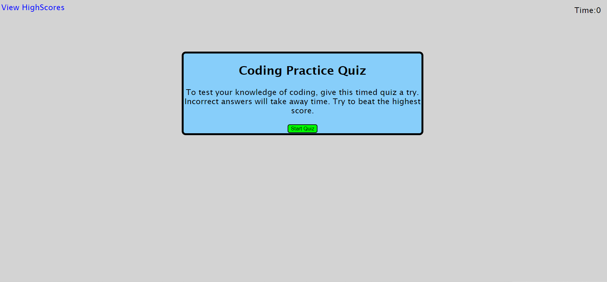
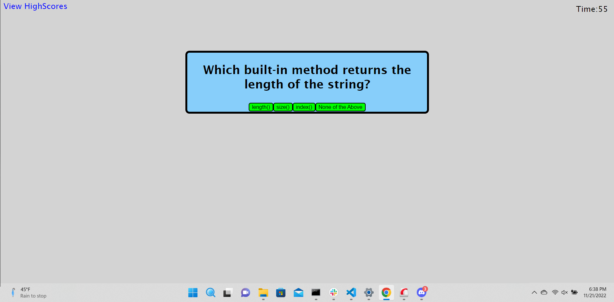
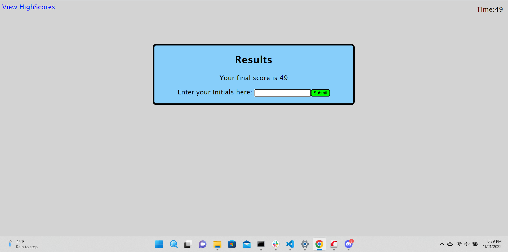

# <Coding-Quiz>

## Description

My motivation for this project was to create an interactive quiz to help study some javascript concepts. It was also a way for me to practice my javascript functions and manipulating the DOM. It helps to solve the problem of making studying more fun with the added challenge of a timer and to be able to compete for the highest score. I learned a lot about how to create elements that users can interact with on a page using javascript.

-- jeremyskinner812

## Installation

No installation is required. Just access the page at the URL ""https://jeremyskinner812.github.io/coding-quiz/"

## Usage

Go to URL "https://jeremyskinner812.github.io/coding-quiz/"

To begin quiz, click on the green start button. 

Your timer will begin at 60 seconds counting down by 1 and you select your answers by clicking the green button with your answer choice. A prompt will appear letting you know if you got the answer correct or not and you will need to click ok before answering the next question. A wrong answer will deduct 10 seconds from your remaining time.

After you finish the questions or run out of time, your score will be displayed and you can enter your initials and click submit to save your score to the highscores page. The highscores can be viewed at any time by clicking the link in the top left corner.

## Credits

List your collaborators, if any, with links to their GitHub profiles.

If you used any third-party assets that require attribution, list the creators with links to their primary web presence in this section.

If you followed tutorials, include links to those here as well.

## License

N/A

.